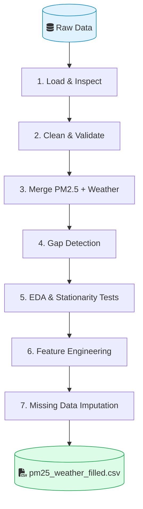
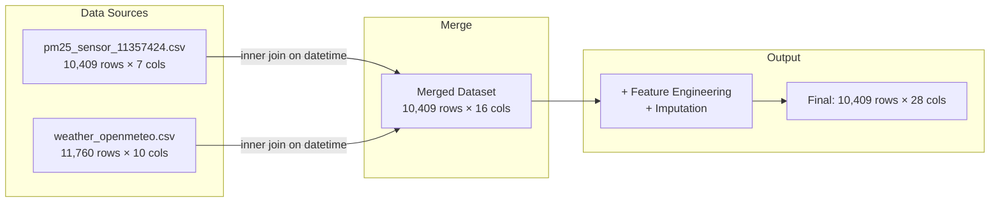
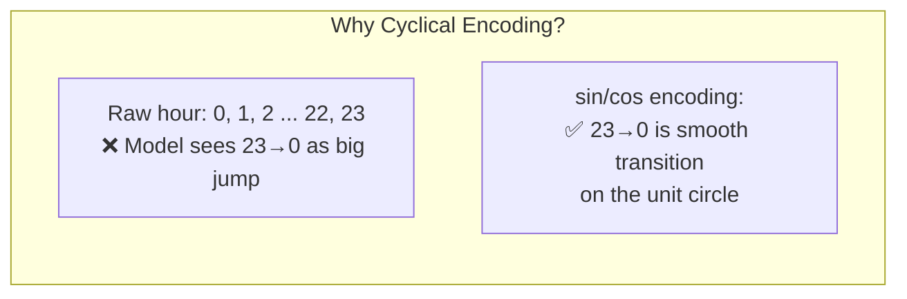
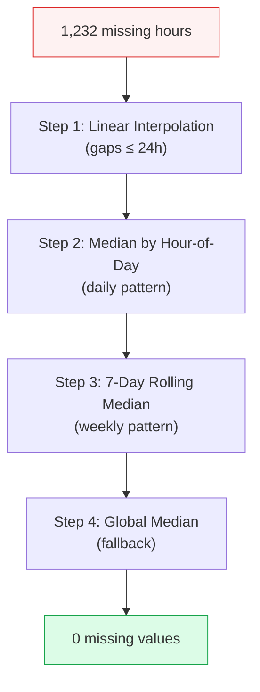

# EDA & Preprocessing Report — PM2.5 Time Series Prediction (HCMC)

## 1. Objective

Perform exploratory data analysis and preprocessing on PM2.5 air quality data from the CMT8 station (Ho Chi Minh City) combined with weather data, preparing a clean dataset for time series forecasting.

---

## 2. Pipeline Overview





---

## 3. Data Sources

| Source | File | Rows | Columns | Time Range |
|--------|------|------|---------|------------|
| OpenAQ (PM2.5 sensor) | `pm25_sensor_11357424.csv` | 10,409 | 7 | 2024-11-19 → 2026-03-22 |
| Open-Meteo (Weather) | `weather_openmeteo.csv` | 11,760 | 10 | 2024-11-19 → 2026-03-22 |

**PM2.5 columns:** datetime, pm25_avg, pm25_min, pm25_max, pm25_sd, pm25_median, coverage_pct

**Weather columns:** datetime, temperature_2m, relative_humidity_2m, precipitation, wind_speed_10m, wind_direction_10m, surface_pressure, boundary_layer_height, wind_u, wind_v

### Loading code

```python
pm25_df = pd.read_csv(PM25_FILE).rename(columns=str.lower)
weather_df = pd.read_csv(WEATHER_FILE).rename(columns=str.lower)
```

---

## 4. Data Quality Assessment

### 4.1 Missing Values
- PM2.5 core columns (avg/min/max/median): **0% missing**
- `pm25_sd`: **100% missing** → dropped from analysis
- Weather columns: **0% missing**
- All PM2.5 records have **100% coverage_pct** (sensor completeness)

### 4.2 Outlier Detection & Filtering

- PM2.5 range: 2.92 – 171.27 µg/m³ (mean = 34.66, median = 31.8)
- High values (>IQR whiskers) are **retained** — they represent genuine high pollution episodes, not sensor errors
- No values exceed 500 µg/m³ (sensor error threshold)

```python
# Flag invalid sensor readings (< 0 or > 500 µg/m³)
invalid_mask = (pm25_clean["pm25_avg"] < 0) | (pm25_clean["pm25_avg"] > 500)
pm25_clean.loc[invalid_mask, "pm25_avg"] = np.nan
# Result: 0 records removed — all values within valid range
```

---

## 5. Data Merging

```python
merged = pd.merge(
    pm25_clean, weather_df,
    on="datetime", how="inner",
    suffixes=("_pm25", "_weather"),
).sort_values("datetime").reset_index(drop=True)
```

- Merged dataset: **10,409 rows × 16 columns**
- No missing values after merge — timing alignment is complete

---

## 6. Timeline Gap Analysis

After resampling to a continuous hourly timeline:

- Total expected hours: **11,761**
- Missing hours: **1,232 (10.46%)**
- Distinct gap episodes: **51**

```python
# Detect gaps in continuous hourly timeline
ts_hourly_full["is_missing_pm25"] = ts_hourly_full["pm25_avg"].isna()
ts_hourly_full["gap_group"] = (
    ts_hourly_full["is_missing_pm25"]
    .ne(ts_hourly_full["is_missing_pm25"].shift())
    .cumsum()
)
gap_summary = (
    ts_hourly_full.loc[ts_hourly_full["is_missing_pm25"]]
    .groupby("gap_group")
    .apply(lambda grp: pd.Series({
        "gap_start": grp.index.min(),
        "gap_end":   grp.index.max(),
        "gap_hours": grp.shape[0],
    }))
    .sort_values("gap_hours", ascending=False)
)
```

### Gap Severity by Month

| Severity | Month | Missing Hours | ~Days |
|----------|-------|---------------|-------|
| Severe | Jan 2025 | 496 | ~20.6 |
| Severe | Jun 2025 | 454 | ~18.9 |
| Severe | Feb 2025 | 282 | ~11.8 |
| Light | 5 months | 6–28 each | <1.2 |
| Negligible | 9 months | 0–4 each | <0.2 |

Three months account for **~91% of all missing data**. Most months have minimal or no gaps.

---

## 7. Time Series Characteristics

### 7.1 Trend & Seasonality
- **Weekly cycle** confirmed via seasonal decomposition (168-hour period)
- **Monthly pattern**: higher pollution in cooler months (Dec–Feb), lower during monsoon season
- 7-day rolling average reveals long-term trend shifts

### 7.2 Stationarity Testing

```python
from statsmodels.tsa.stattools import adfuller, kpss

# ADF test — null hypothesis: series has a unit root (non-stationary)
adf_stat, adf_p, adf_lags, adf_nobs, adf_crit, _ = adfuller(stationary_series, autolag="AIC")

# KPSS test — null hypothesis: series is stationary
kpss_stat, kpss_p, kpss_lags, kpss_crit = kpss(stationary_series, regression="ct", nlags="auto")
```

- **ACF**: slow decay over 72 hours → strong autocorrelation
- **PACF**: significant spike at lag 1, then drops → consistent with AR(1) / I(1)
- **Conclusion**: series is **non-stationary** → differencing or detrending required for statistical models

---

## 8. Feature Engineering

### 8.1 Temporal Features

| Feature | Description |
|---------|-------------|
| `year`, `month`, `day`, `hour` | Extracted from datetime |
| `weekday` | 0 = Monday, 6 = Sunday |
| `is_weekend` | Binary (0/1) |
| `hour_sin`, `hour_cos` | Cyclical encoding of hour (period = 24) |
| `month_sin`, `month_cos` | Cyclical encoding of month (period = 12) |

### 8.2 Cyclical Encoding

```python
# Prevents artificial jumps at boundaries (e.g., hour 23 → 0)
merged["hour_sin"]  = np.sin(2 * np.pi * merged["hour"]  / 24)
merged["hour_cos"]  = np.cos(2 * np.pi * merged["hour"]  / 24)
merged["month_sin"] = np.sin(2 * np.pi * merged["month"] / 12)
merged["month_cos"] = np.cos(2 * np.pi * merged["month"] / 12)
```



---

## 9. Missing Data Imputation



### Implementation

```python
# Step 1: Linear interpolation for short gaps (≤24 hours)
ts["pm25_filled"] = ts["pm25_filled"].interpolate(
    method="time", limit=24, limit_direction="both"
)

# Step 2: Fill with median of same hour-of-day
hourly_median = ts.groupby(ts.index.hour)["pm25_filled"].transform("median")
ts.loc[still_missing, "pm25_filled"] = hourly_median[still_missing]

# Step 3: 7-day rolling median (captures weekly pattern)
rolling_median = ts["pm25_filled"].rolling(
    window=24*7, min_periods=1, center=True
).median()
ts.loc[still_missing, "pm25_filled"] = rolling_median[still_missing]

# Step 4: Global median fallback
global_med = ts["pm25_filled"].median()
ts.loc[still_missing, "pm25_filled"] = global_med
```

Each record has a `fill_method` column tracking which step was used.

---

## 10. Final Output

- **File:** `data/processed/pm25_weather_filled.csv`
- **Shape:** 10,409 rows × 28 columns
- **Contents:** Original PM2.5 + weather + temporal features + imputed PM2.5 + imputation tracking

```python
merged_filled.to_csv(processed_path, index=False)
```

---

## 11. Key Takeaways for Modeling

1. **Data is clean** — quality issues come from temporal gaps, not sensor errors
2. **Strong periodicity** — weekly and daily cycles are present; cyclical features capture this
3. **Non-stationary** — differencing or detrending needed for ARIMA-type models; tree-based models can handle this natively
4. **Gap distribution is skewed** — 3 months dominate missing data; imputation reliability is lower for those periods
5. **Feature set is ready** — temporal, meteorological, and lag features are prepared for downstream modeling
