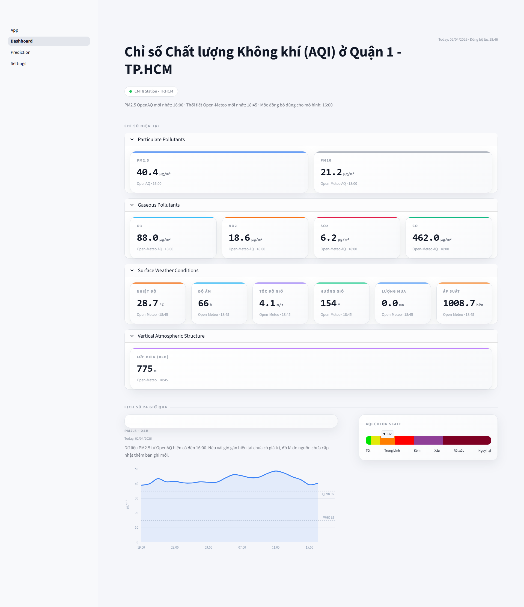
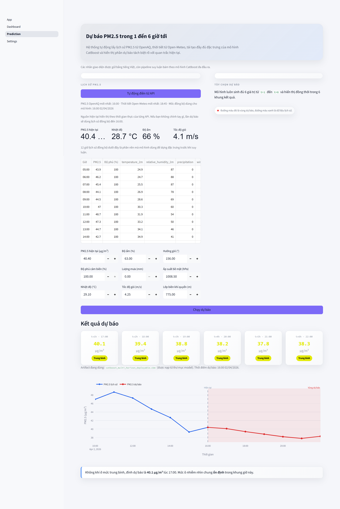

# PM2.5 forecasting for Ho Chi Minh City

## Summary

This project is a Streamlit application for real-time air-quality monitoring and short-term PM2.5 forecasting in Ho Chi Minh City. It fetches PM2.5 history from OpenAQ and weather data from Open-Meteo, performs preprocessing and feature construction, uses a CatBoost multi-horizon model (6 horizons), and presents results in a Streamlit UI.





## Goals

- Monitor current PM2.5 from sensors / OpenAQ.
- Provide short-term PM2.5 forecasts for 6 horizons (t+1 ... t+6).
- Offer a Dashboard and Prediction page for interactive use.

## Project structure (high-level)

- `App.py` — Streamlit entrypoint.
- `config.py` — common configuration (env vars, constants).
- `data/` — raw (`raw/`) and processed (`processed/`) datasets.
- `notebooks/` — EDA, preprocessing, and training reference notebooks.
- `model/` — helper scripts and model-related utilities.
- `pages/` — Streamlit pages:
  - `1_Dashboard.py` — current conditions and 24h PM2.5 chart.
  - `2_Prediction.py` — prediction UI with autofill/manual override.
  - `3_Settings.py` — theme and color controls.
- `src/` — main source code:
  - `src/api.py` — aggregates OpenAQ + Open-Meteo data and computes AQI.
  - `src/aqi.py` — AQI breakpoints, nowcast logic, and VN conversion.
  - `src/ui.py` — shared Streamlit CSS / theme helpers.
  - `src/data/` — data collectors: `collect_openaq.py`, `collect_openmeteo.py`.
  - `src/inference/` — inference pipeline and artifact management:
    - `feature_builder.py`, `artifact.py`, `predict.py`, `train_artifact.py`.
  - `src/services/` — API clients for OpenAQ / Open-Meteo.

## Key data files

- `data/raw/` — raw inputs (e.g. `pm25_sensor_11357424.csv`, `weather_openmeteo.csv`).
- `data/processed/` — cleaned and merged data (e.g. `pm25_processed_data.csv`).

## Environment & Installation

Requirements: Python 3.10+ recommended.

Windows (PowerShell):

```powershell
python -m venv .venv
.\.venv\Scripts\Activate.ps1
pip install -r requirements.txt
```

Git Bash / WSL:

```bash
python -m venv .venv
source .venv/Scripts/activate
pip install -r requirements.txt
```

Create a `.env` file (or copy `.env.example` if present) and set required variables, for example:

```
OPENAQ_API_KEY=your_openaq_api_key
OPENAQ_SENSOR_ID=11357424
OPENMETEO_LAT=10.8231
OPENMETEO_LON=106.6297
```

## Run locally

- (Optional) Rebuild deployable model artifacts from local data:

```bash
python -m src.inference.train_artifact
```

- Start the Streamlit app:

```bash
streamlit run App.py
```

Open the URL printed by Streamlit (default http://localhost:8501) in your browser.

## Model & Inference

- Reference deployable artifacts are stored in `notebooks/model/multi_6h_weights/` (e.g. `.cbm` and `deployment_metadata.json`).
- `src/inference/artifact.py` locates and loads the model + metadata; if none are found, `train_artifact.py` can rebuild them from local CSVs.
- `src/inference/predict.py` orchestrates end-to-end forecasting used by the UI.

## Technical notes

- Forecast horizon is fixed at 6 (t+1..t+6) in the current pipeline.
- AQI and nowcast logic live in `src/aqi.py` and follow VN breakpoints.
- Streamlit caching (e.g. `ttl=300`) is used for API-backed calls to reduce load and latency.

## Contributing

- Create a feature branch, describe changes, and open a Pull Request.
- To change the default sensor or data source, update `.env` or `config.py` accordingly.

---

If you want, I can:

- (A) Replace the project `README.md` with this English version.
- (B) Keep the existing `README.md` and keep this file `README_EN.md` alongside the Vietnamese version.

Tell me A or B (or another preference) and I'll proceed.
